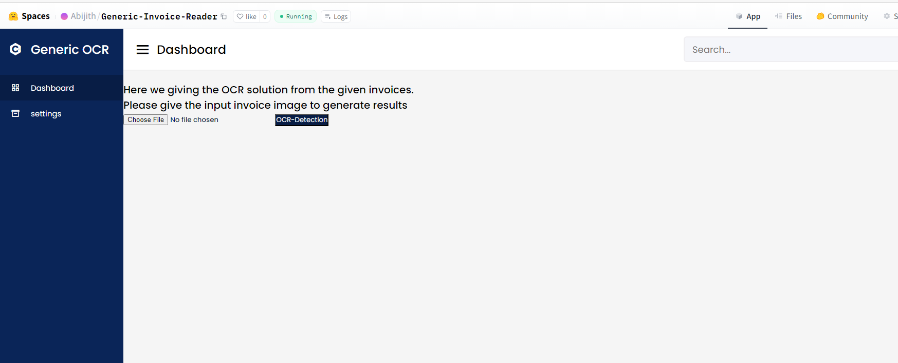

# Generic-Invoice-Reader
Here we are trying to get a general **OCR** solution for the invoices and bills.
Its yolov4 based fastapi tesseract ocr solution.

## Improvements
- Need to improve the UI(It is a sample UI).
- Need to improve the extraction quality of model.

Full Code is avaialable here : [ClickHere](https://gitlab.com/abijithe61/yol-ov-4-tf-lite-for-generic-invoice-reader.git)

## Run in local
- Install all the dependencies ``` pip install requirement.txt ```
- Run - ``` uvicorn main:app --realod ```

## Deployments
Deployed the solution in huggingface Link : [ClickHere](https://huggingface.co/spaces/Abijith/Generic-Invoice-Reader)




